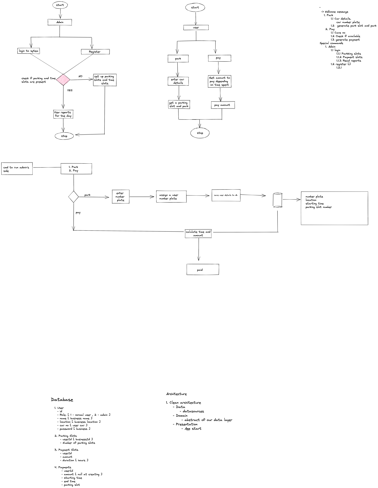

# Bo - Parking System

This is a parking System that runs on intelliJ terminal. It helps users to park their cars and pay for the duration they have stayed in the parking system. It also allows admins to login, register and enter details about their parking locations.

# Table Of Contents

* [About the App](#about-the-app)
* [General Preview](#general-preview)
* [System Design](#system-design)
* [Run Project](#run-project)
* [Installation](#installation)
* [Dependencies](#dependencies)
* [Contributors](#contributors)
* [License](#license)

## About the App
The app has the following key features:

1. An Admin has special commands that allow him to:

    - Login
    - Register
    - Set number of parking slots available
    - Set parking rates charges - this is based per hour
    - View reports -wip
2. A normal user can do the following things:
    - Park 
    - Get an available parking slot
    - Pay 

## General Preview
Images

## System Design
The system design of the application



## Run the Project
```bash
  git clone https://github.com/Njumbi/BoParking.git
```

- Open the project in intelliJ and install dependencies

- Run the app 

## Dependencies
 - Gson
 - Junit 5
 - Coroutines
 - script-runtime

## Contributors
Auto-populated from:[contrib.rocks](https://contrib.rocks)

## Contributing

Contributions are always welcome!

See [contributing guidelines](https://github.com/github/docs/blob/main/CONTRIBUTING.md) for ways to get started.

Please adhere to this project's `code of conduct`.


1. Fork it
2. Create your feature branch (git checkout -b my-new-feature)
3. Commit your changes (git commit -m 'Add some feature')
4. Push your branch (git push origin my-new-feature)
5. Create a new Pull Request and set ```dev``` as the base branch

## License

[MIT](https://choosealicense.com/licenses/mit/)